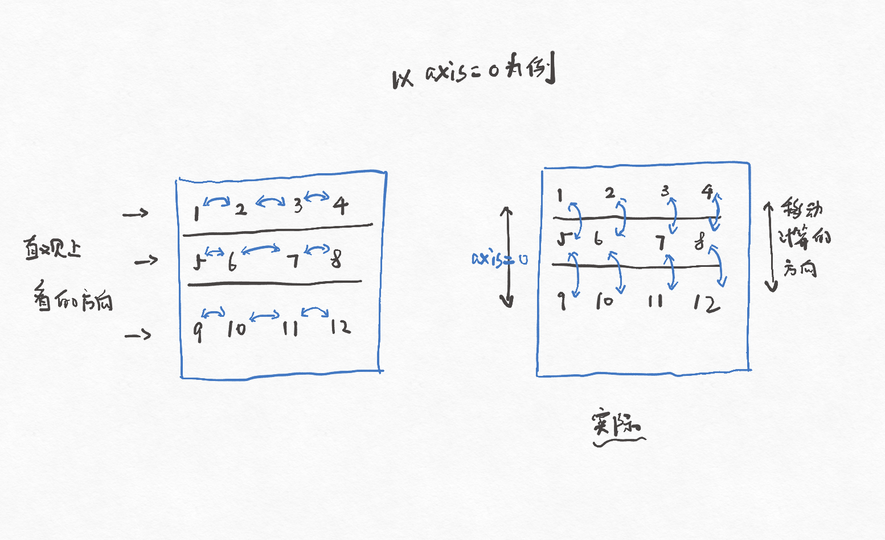
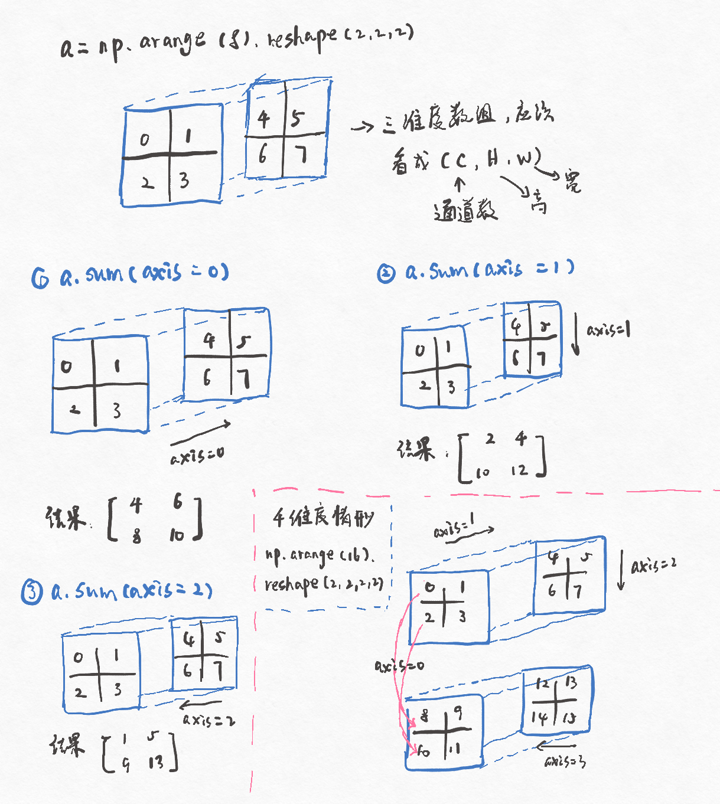
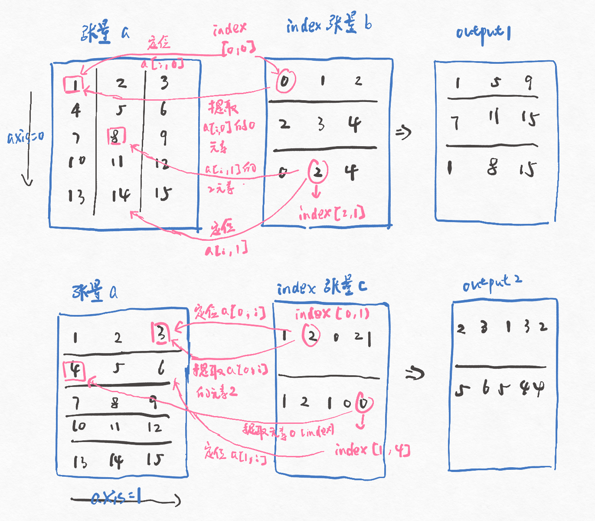
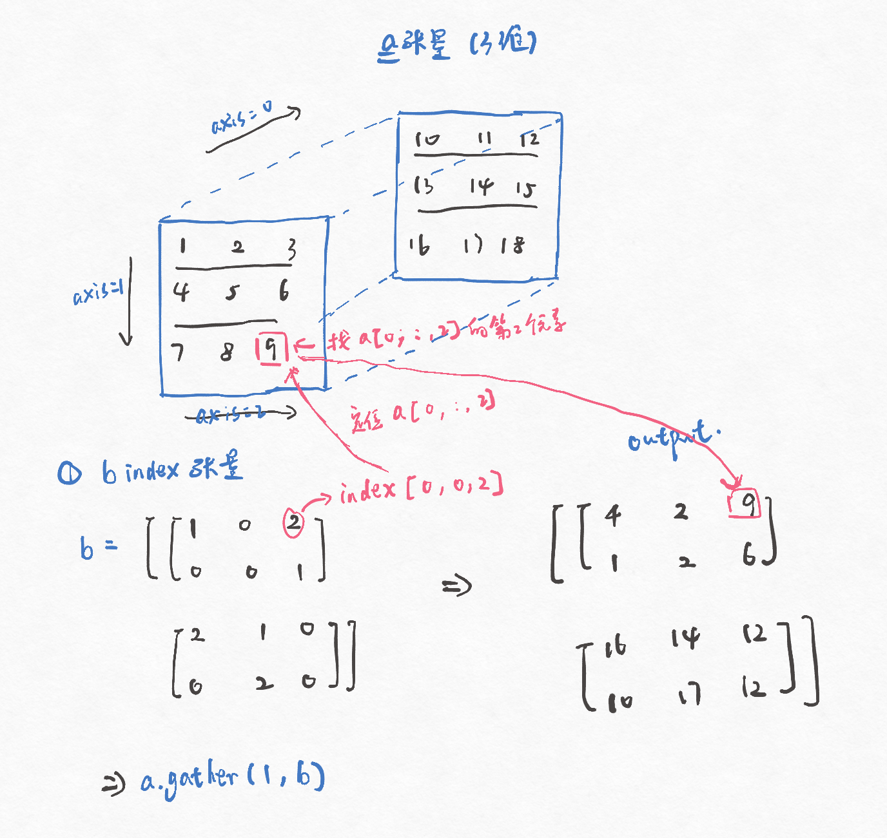

[TOC]

完整内容（还写了其他一些选择函数）见本人博客：https://www.cnblogs.com/liangjianli/p/13754817.html

### 1. 维度的理解

&emsp;&emsp;对于numpy和pytorch，其数组在做维度运算上刚开始可能会给人一种直观上的误解，以numpy求矩阵某个维度的最大值为例（pytorch的理解也是一样的）
```
import numpy as np
a = np.arange(1, 13).reshape(3, 4)
"""
result:
a = [[1, 2, 3, 4],
      [5, 6, 7, 8,],
      [9, 10, 11, 12]]
"""

# 对a维度0求最大值
a.max(axis = 0)
"""
result:
[9, 10, 11, 12]
"""

# 对a维度1求最大值
a.max(axis = 1)
"""
result:
[4, 8, 12]
"""
```
&emsp;&emsp;如果对a矩阵在维度0上找最大值，根据我们直观上的经验应该是[4, 8, 12]。即从[1, 2, 3, 4]找到4，从[5, 6, 7, 8]找到8，从[9, 10, 11, 12]找到12。但是从上面结果来看，numpy运算却给了我们直观上认为是列最大值的结果[9, 10, 11, 12]。
&emsp;&emsp;实际numpy（pytorch）运算应该理解为**往给定的维度进行移动运算**。还是以维度0为例，维度0上有3个向量，分别为[1, 2, 3, 4]，[5, 6, 7, 8]和[9, 10, 11, 12]。往维度0移动，即[1, 2, 3, 4]和[5, 6, 7, 8]逐元素计算最大值，得到[5, 6, 7, 8]，再和[9, 10, 11, 12]运算得到结果[9, 10, 11, 12]。

<div align="center">

</div>

&emsp;&emsp;另外，对于维度为3的数组，在numpy和pytorch中，应该把维度0理解为通道数，维度1和维度2才是对应高和宽。如果是3维数组对应着用于多输入通道和单输出通道的卷积核（维度为U x V x D），那么4维数组就对应着用于多输入通道和多输出通道的卷积核（维度为U x V x D x P），此时，维度0则为多通道卷积核数量的方向，维度1为通道数，维度2和3才是分别对应高和宽。
<div align="center">

</div>


### 2. gather函数
pytorch和numpy中许多函数都涉及维度运算，`gather`也不例外，但是它相对于其他函数更难理解。依然先来看一个例子
```
import torch
a = torch.arange(1, 16).reshape(5, 3)
"""
result:
a = [[1, 2, 3],
      [4, 5, 6],
      [7, 8, 9],
      [10, 11, 12],
      [13, 14, 15]]
"""

# 定义两个index
b = torch.tensor([[0, 1, 2], [2, 3, 4], [0, 2, 4]])
c = torch.tensor([[1, 2, 0, 2, 1], [1, 2, 1, 0, 0]])

# axis=0
output1 = a.gather(0, b)
"""
result:
[[1, 5, 9],
[7, 11, 15],
[1, 8, 15]]
"""

# axis=1
output2 = a.gather(1, c)
"""
result:
[[2, 3, 1, 3, 2],
[5, 6, 5, 4, 4]]
"""
```

上面的例子看起来可能有点复杂，我们来一步步的分析它，先从gather维度为0开始讲起。
1. `a.gather(0, b)`分为3个部分，`a`是需要被提取元素的矩阵，`0`代表的是提取的维度为0，`b`是提取元素的索引
      - 其中规定b和a是同维张量，即a是2维张量，b也必须是2维张量
2. `0`除了代表往维度0的方向提取元素外，还有一个特权---提取结果output可以在这个维度上的长度与a不同。打个比方，a现在的shape为(5, 3)，那么提取结果output1的shape可以是(1,3)，(2, 3)，甚至(n, 3)。具体维度0的长度到底为多少由b来决定。
3. 根据`0`的特权，导致了给定的b张量除了维度0外，其他的维度大小必须和a一样。其中张量`b`实际上包含以下两个信息
      - b可以利用除用于gather的维度（此处为维度0）外的维度来定位出唯一一个向量，也就是a[:, ?]（三维度也是同理的，有a[:, ?1, ?2]）,?的取值范围为a同维度的index。
      - 对于上述定位出的向量，通过b中的元素来定位提取向量中的哪一个元素。
      - 上面说得可能有点抽象，实际上b中的每个元素都能在a中提取出一个元素。举个具体点的例子，按照上面所说的，b[0, 0]可以提取a中的一个元素。对于b[0,0]，除了维度0外，可以通过维度1来定位出唯一一个向量a[:, 0]。因为b[0, 0]的元素为0，即提取的是a[:, 0]的第0个元素---1，并将其作为output1[0, 0]的提取结果。
下图给出了维度0和维度1，gather运算的图示
<div align="center">

</div>

对于3维或者更高维度的张量gather的原理也是一样的
<div align="center">

</div>

